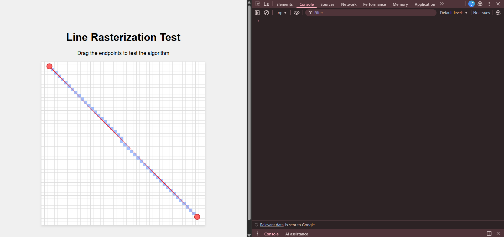
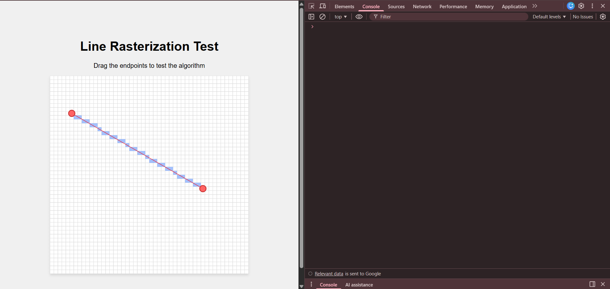
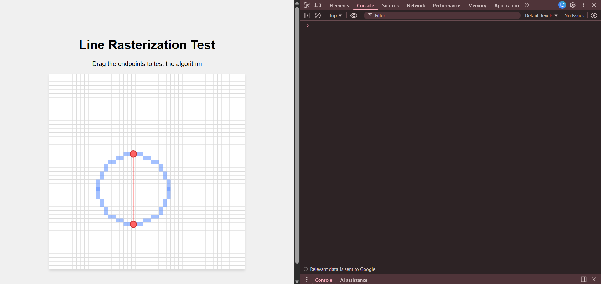
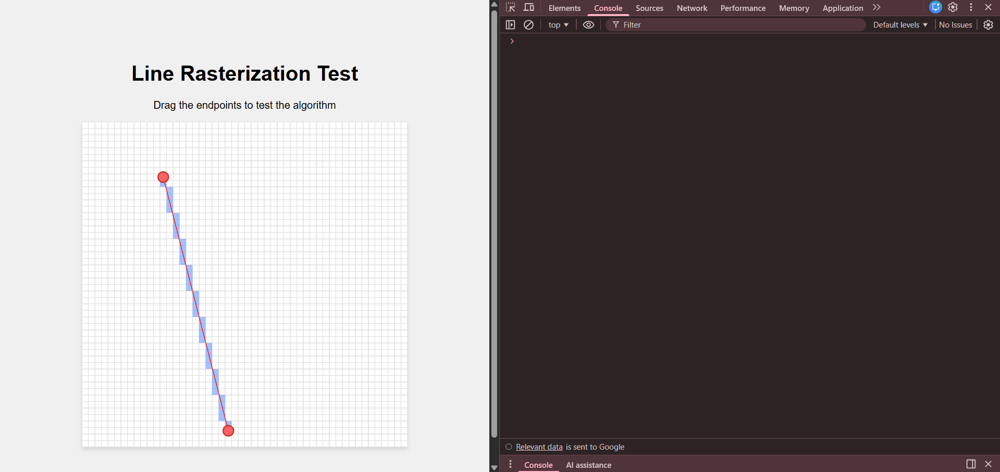

# Computer Graphics Rasterization Assignment  
**Subject Code:** BTCS-T-PE-028  
**Name:** Ayesha Mohapatra  

---

## Implemented Algorithms

- Bresenham Line Drawing Algorithm  
- DDA Line Drawing Algorithm  
- Midpoint Circle Drawing Algorithm  
- Wu’s Line Drawing Algorithm (Bonus)  

Each algorithm was implemented in JavaScript and tested using the provided rasterization framework.

---

## 1. Bresenham Line Drawing Algorithm

**Description:**  
Integer-based line rasterization supporting all quadrants and slopes.

**Test Results:**

---

## 2. DDA Line Drawing Algorithm

**Description:**  
Floating-point based Digital Differential Analyzer line drawing.

**Test Results:**

---

## 3. Midpoint Circle Drawing Algorithm

**Description:**  
Circle rasterization using midpoint decision parameter and 8-way symmetry.

**Test Results:**

---

## 4. Wu’s Line Drawing Algorithm (Bonus)

**Description:**  
Anti-aliased line drawing using Xiaolin Wu’s approach.

**Test Results:**

---

## Conclusion

All required rasterization algorithms were successfully implemented and tested.  
Bresenham line drawing supports all quadrants.  
DDA and Midpoint Circle algorithms produce correct results.  
Wu’s algorithm was implemented as a bonus.

---
